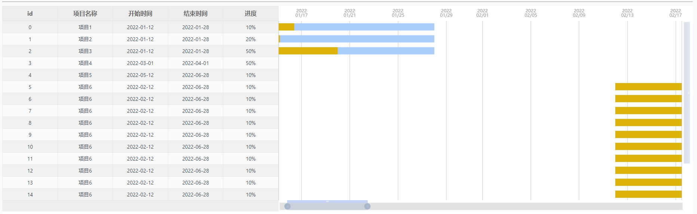
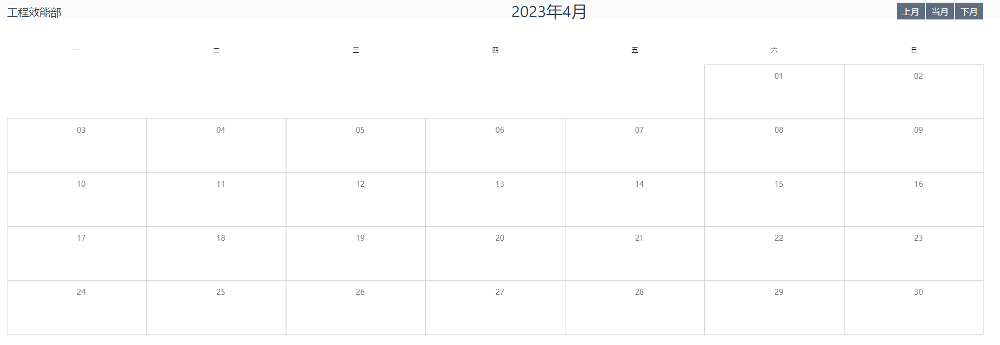
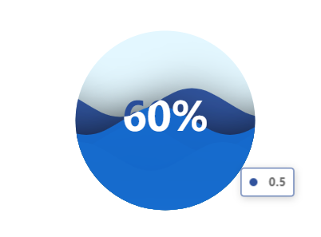

# grace-chart

优雅的图表库，基于Apache ECharts 5与Vue3

中文文档：[https://epgautoman.github.io/grace-charts/#/](https://epgautoman.github.io/grace-charts/#/)


## 功能

对Apache ECharts进行二次封装，同时基于 Echarts 进行了一些拓展，增加了甘特图、任务日历图等，支持数据响应式变化，可自适应浏览器窗口尺寸变化，并可以在一些延迟加载的组件中完美渲染，我们期望可以通过此库完成绝大部分数据可视化的展示，以下是已实现的图表列表：

- 甘特图
- 日历图
- 词云图
- 水球图
- 盒须图
- 折线图
- 柱状图
- 蜡烛图
- 漏斗图
- 拼图/环形饼图
- 仪表盘
- 关系图
- 热力图
- 雷达图
- 桑基图
- 散点图
- ... ...


## UI展示

甘特图



日历图



水球图



## 快速开始

1. **使用 npm 安装 grace-charts**

```
npm i grace-charts echarts -S
```

全局注册组件（也可以单组件注册，后文会讲到）

```js
import { createApp } from 'vue';
import graceCharts from 'grace-charts';

const app = createApp(..options);
app.use(graceCharts);
```

使用组件

```js
<template>
	<grace-line :loading="loading" :dataset="dataset"></grace-line>
</template>

<script>
import { ref } from "vue";

export default {
  name: "App",
  setup() {
    const dataset = ref({
      dimensions: [],
      source: [],
    });
    const loading = ref(true);
    setTimeout(() => {
      dataset.value = {
        dimensions: ["时间", "数量"],
        source: [
          { 时间: "2020-01", 数量: 100 },
          { 时间: "2020-02", 数量: 110 },
          { 时间: "2020-03", 数量: 120 },
          { 时间: "2020-04", 数量: 130 },
          { 时间: "2020-05", 数量: 140 },
        ],
      };
      loading.value = false;
    }, 2000);
    return {
      dataset,
      loading,
    };
  },
};
</script>
```


2. **使用CDN**

   可直接在 html 中使用组件，引入：

```
<script src="https://cdn.jsdelivr.net/npm/grace-charts@latest/dist/grace-charts.umd.min.js"></script>
```

详细使用示例：

```
<!DOCTYPE html>
<html>
<head>
  <meta charset="utf-8">
  <meta name="viewport" content="width=device-width">
  <title>grace-charts line example</title>
  <style>
    #app {
      width: auto;
      height: 400px;
    }
  </style>
  <script src="https://cdn.jsdelivr.net/npm/vue@latest/dist/vue.global.prod.js"></script>
  <script src="https://cdn.jsdelivr.net/npm/echarts@latest/dist/echarts.min.js"></script>
  <script src="https://cdn.jsdelivr.net/npm/grace-charts@latest/dist/grace-charts.umd.min.js"></script>
</head>
<body>
  <div id="app">
    <grace-line :dataset="dataset" theme="light"></grace-line>
  <div>
  <script>
    Vue.createApp({
      components: { 'grace-line': window['grace-charts']['GraceLine'] },
      setup(){
        return {
          dataset: Vue.ref(
            {
              dimensions: ["时间", "数量"],
              source: [
                { 时间: "2020-01", 数量: 100 },
                { 时间: "2020-02", 数量: 110 },
                { 时间: "2020-03", 数量: 120 },
                { 时间: "2020-04", 数量: 130 },
                { 时间: "2020-05", 数量: 140 },
              ],
            }
          ),
        }
      }
    }).mount('#app');
  </script>
</body>
</html>

```

## 帮助文档

中文文档：[https://epgman.github.io/grace-charts/#/](https://epgman.github.io/grace-charts/#/)

